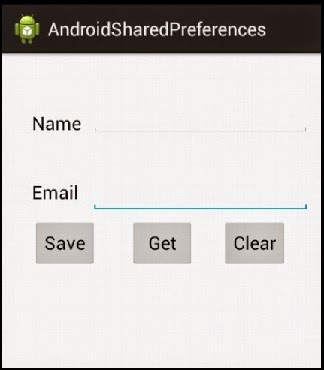

# 16 Saving Data

[http://developer.android.com/training/basics/data-storage/index.html](http://developer.android.com/training/basics/data-storage/index.html)

## Shared Preferences ##

[http://developer.android.com/training/basics/data-storage/shared-preferences.html](http://developer.android.com/training/basics/data-storage/shared-preferences.html)

### Tutorial: ###

[http://www.androidgreeve.com/2014/01/How-to-use-Shared-Preferences-and-manage-User-Sessions.html](http://www.androidgreeve.com/2014/01/How-to-use-Shared-Preferences-and-manage-User-Sessions.html)

### Oefening 1

Gebruik shared preferences om iets op te slagen

### Oefening 2 ###

- Bouw een scherm gelijkaardig aan onderstaande screenhot
- Voeg de bijhorende functionaliteit toe.

## Saving Files ##

[http://developer.android.com/training/basics/data-storage/files.html](http://developer.android.com/training/basics/data-storage/files.html)

### Oefening: ###

Gebruik het fototoestel van je toestel in je applicatie om een foto te nemen.  (Tip:  `startActivityForResult` )

[http://developer.android.com/guide/topics/media/camera.html#intents](http://developer.android.com/guide/topics/media/camera.html#intents)

Slaag deze foto op in Pictures directory van je toestel.

**Extra:**
Slaag een thumbnail op van de foto die je getrokken hebt

## Databases ##
[http://developer.android.com/training/basics/data-storage/databases.html](http://developer.android.com/training/basics/data-storage/databases.html)

Tutorial:

[http://www.techotopia.com/index.php/An_Android_SQLite_Database_Tutorial](http://www.techotopia.com/index.php/An_Android_SQLite_Database_Tutorial)